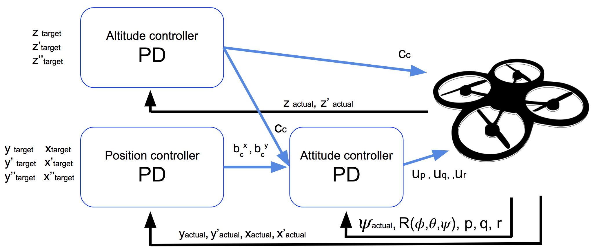
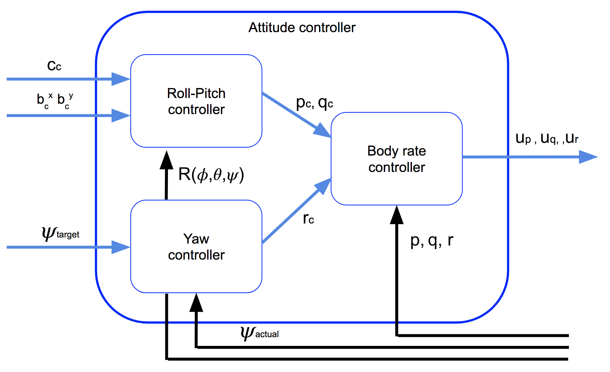

# Project Control 3D Quadrotor
Junqiang Zhou

---
  |  
:-------------------------:|:-------------------------:

 Fig. Schematic diagram of drone 

---
In our notation, the propellers 1 and 4 rotate in clockwise thus producing the moment in the counterclockwise direction with positive sign and propellers 2 and 3 rotate in counterclockwise thus the resulting moments are in opposite and have the negative signs.

---
  

 Fig. Hierarchical Control Architecture 

---

* `GenerateMotorCommands()` calculates each motor command from desired moment and collective thrust based on the following equation:
$$ F_1 + F_3 - F_2 - F_4 = \tau_x/l $$
$$ F_1 + F_2 - F_3 - F_4 = \tau_y/l $$
$$ F_1 - F_2 - F_3 + F_4 = -\tau_z/\kappa $$
$$F_1 + F_2 + F_3 + F_4  = F_{total} $$

* `BodyRateControl()`: The commanded roll, pitch, and yaw are collected by the body rate controller, and they are translated into the desired rotational accelerations along the axis in the body frame as follows:
$$ \bar{u}_p = k_{p-P}(p_c - p), \qquad \tau_x =  I_x \bar{u}_p $$
$$ \bar{u}_q = k_{p-Q}(q_c - q), \qquad \tau_x =  I_y \bar{u}_q $$
$$ \bar{u}_r = k_{p-R}(r_c - r), \qquad \tau_z =  I_z \bar{u}_r $$

* `RollPitchControl()`: The roll-pitch controller is a P controller responsible for commanding the roll and pitch rates ($p_c$ and $q_c$) in the body frame.  First, it sets the desired rate of change of the given matrix elements using a P controller.
$$\dot{b}^x_c  = k_p(b^x_c - b^x_a),\qquad b^x_c = \dfrac{\ddot{x}_c}{c},\qquad b^x_a = R_{13}$$
$$\dot{b}^y_c  = k_p(b^y_c - b^y_a),\qquad b^y_c = \dfrac{\ddot{y}_c}{c},\qquad b^y_a = R_{23}$$
&nbsp;&nbsp;&nbsp;&nbsp;&nbsp;&nbsp;&nbsp;&nbsp;
where subscript c means "commanded" and a means "actual".

&nbsp;&nbsp;&nbsp;&nbsp;&nbsp;&nbsp;&nbsp;&nbsp;
The given values can be converted into the angular velocities into the body frame by the next matrix multiplication.
$$
\begin{pmatrix} p_c \\ q_c \\ \end{pmatrix}  = \frac{1}{R_{33}}\begin{pmatrix} R_{21} & -R_{11} \\ R_{22} & -R_{12} \end{pmatrix} \times \begin{pmatrix} \dot{b}^x_c \\ \dot{b}^y_c  \end{pmatrix}
$$

* `LateralPositionControl()`: The lateral controller will use a PD controller to command target values for elements of the drone's rotation matrix. The drone generates lateral acceleration by changing the body orientation which results in non-zero thrust in the desired direction. This will translate into the commanded rotation matrix elements $b^x_c$ and $b^y_c$. The control equations have the following form:
$$
\ddot{x}_{c} =  k^x_p(x_t-x_a) + k_d^x(\dot{x}_t - \dot{x}_a)+ \ddot{x}_t
$$
$$
\ddot{y}_{c} =  k^y_p(y_t-y_a) + k_d^y(\dot{y}_t - \dot{y}_a)+ \ddot{y}_t
$$

* `AltitudeControl()`: The individual linear acceleration has the form of
$$
\ddot{z} = c b^z +g, b^z = R_{33}
$$
&nbsp;&nbsp;&nbsp;&nbsp;&nbsp;&nbsp;&nbsp;&nbsp;
We are controlling the vertical acceleration:
$$\bar{u}_1 = \ddot{z} = c b^z +g$$
&nbsp;&nbsp;&nbsp;&nbsp;&nbsp;&nbsp;&nbsp;&nbsp;
Therefore
$$c = \dfrac{F_{total}}{m} = (\bar{u}_1-g)/b^z$$  

&nbsp;&nbsp;&nbsp;&nbsp;&nbsp;&nbsp;&nbsp;&nbsp;
To account for model mismatches, a PID controller is used for the altitude which results in:
$$\bar{u}_1 = k_{p-z}(z_{t} - z_{a})  k_{p-i}\int_0^{t}(z_{t} - z_{a}) + k_{d-z}(\dot{z}_{t} - \dot{z}_{a}) + \ddot{z}_t$$

* `YawControl()`: Control over yaw is decoupled from the other directions. A P controller is used to control the drone's yaw.
$$r_c = k_p (\psi_t - \psi_a)$$

### Scenario 1. Testing it out.
Tune the Mass parameter in QuadControlParams.txt to make the vehicle hover in the space.

~~~
PASS: ABS(Quad.PosFollowErr) was less than 0.500000 for at least 0.800000 seconds.
~~~

### Scenario 2. Body rate and roll/pitch control ###

1. Implement body rate control  - a proportional controller on body rates to commanded moments

 - implement the code in the function `GenerateMotorCommands()`
 - implement the code in the function `BodyRateControl()`
 - Tune `kpPQR` in `QuadControlParams.txt` to get the vehicle to stop spinning quickly but not overshoot

2. Implement roll / pitch control
 - implement the code in the function `RollPitchControl()`
 - Tune `kpBank` in `QuadControlParams.txt` to minimize settling time but avoid too much overshoot

~~~
PASS: ABS(Quad.Roll) was less than 0.025000 for at least 0.7500000 seconds.
PASS: ABS(Quad.Omega.X) was less than 2.500000 for at least 0.7500000 seconds.
~~~

### Scenario 3. Position/velocity and yaw angle control
 - implement the code in the function `LateralPositionControl()`
 - implement the code in the function `AltitudeControl()`
 - tune parameters `kpPosZ` and `kpPosZ`
 - tune parameters `kpVelXY` and `kpVelZ`
 - implement the code in the function `YawControl()`
 - tune parameters `kpYaw` and the 3rd (z) component of `kpPQR`

~~~
PASS: ABS(Quad1.Pos.X) was less than 0.100000 for at least 1.250000 seconds
PASS: ABS(Quad2.Pos.X) was less than 0.100000 for at least 1.250000 seconds
PASS: ABS(Quad2.Yaw) was less than 0.100000 for at least 1.000000 seconds
~~~

### Scenario 4. Non-idealities and robustness
1. Run your controller & parameter set from Step 3.  Do all the quads seem to be moving OK?  If not, try to tweak the controller parameters to work for all 3 (tip: relax the controller).

2. Edit `AltitudeControl()` to add basic integral control to help with the different-mass vehicle.

3. Tune the integral control, and other control parameters until all the quads successfully move properly.  Your drones' motion should look like this:

~~~
PASS: ABS(Quad1.PosFollowErr) was less than 0.100000 for at least 1.500000 seconds
PASS: ABS(Quad2.PosFollowErr) was less than 0.100000 for at least 1.500000 seconds
PASS: ABS(Quad3.PosFollowErr) was less than 0.100000 for at least 1.500000 seconds
~~~

### Scenario 5. Tracking trajectories
Now that we have all the working parts of a controller, you will put it all together and test it's performance once again on a trajectory.  For this simulation, you will use `Scenario 5`.  This scenario has two quadcopters:
 - the orange one is following `traj/FigureEight.txt`
 - the other one is following `traj/FigureEightFF.txt` - for now this is the same trajectory.

~~~
PASS: ABS(Quad2.PosFollowErr) was less than 0.250000 for at least 3.000000 seconds
~~~

## [Rubric](https://review.udacity.com/#!/rubrics/1534/view) Points
* Implemented body rate control in C++. (`The controller should be a proportional controller on body rates to commanded moments. The controller should take into account the moments of inertia of the drone when calculating the commanded moments.`)

 See implementation in C++ at line 113-119 in QuadControl.cpp

* Implement roll pitch control in C++. (`The controller should use the acceleration and thrust commands, in addition to the vehicle attitude to output a body rate command. The controller should account for the non-linear transformation from local accelerations to body rates. Note that the drone's mass should be accounted for when calculating the target angles.`)

 See implementation in C++ at line 146-162 in QuadControl.cpp

* Implement altitude controller in C++. (`The controller should use both the down position and the down velocity to command thrust. Ensure that the output value is indeed thrust (the drone's mass needs to be accounted for) and that the thrust includes the non-linear effects from non-zero roll/pitch angles.
Additionally, the C++ altitude controller should contain an integrator to handle the weight non-idealities presented in scenario 4.`)

 See implementation in C++ at line 190-198 in QuadControl.cpp

* Implement lateral position control in C++. (`The controller should use the local NE position and velocity to generate a commanded local acceleration.`)

 See implementation in C++ at line 232-244 in QuadControl.cpp

* Implement yaw control in C++. (`The controller can be a linear/proportional heading controller to yaw rate commands (non-linear transformation not required).`)

 See implementation in C++ at line 263-266 in QuadControl.cpp

* Implement calculating the motor commands given commanded thrust and moments in C++. (`The thrust and moments should be converted to the appropriate 4 different desired thrust forces for the moments. Ensure that the dimensions of the drone are properly accounted for when calculating thrust from moments.`)

 See implementation in C++ at line 71-92 in QuadControl.cpp
